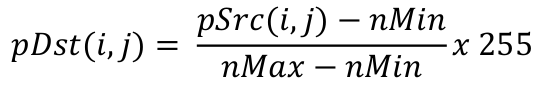
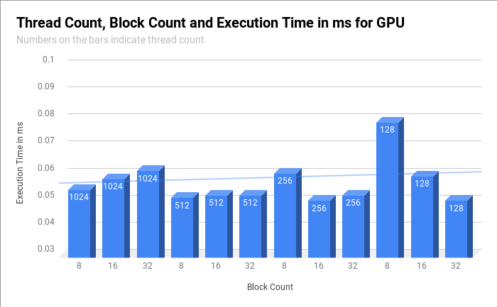

# Problem Definition

Problem is finding minimum and maximum values from an
image which includes big number of pixels and arranging the image according to the min&max
values. Main problem is finding min&max values in parallel manner. Apart from CPU, in
order to prevent sequential operations Parallel Reduction is key point for finding
min&max. Parallelization must help to traverse the image in shorter time than CPU
because of high number of cores.\
\
Pixel values are calculated according to the following formula:



# Algorithm Description
Algorithm handles the image as 1D array. During first
kernel, each block finds a min&max value and store them in global memory. Another
kernel finds one minimum and one maximum value from the output of first kernel. Then
another kernel traverses all image and finds new pixel values. I have used Parallel
Reduction v7. In this version each threads takes multiple values from global memory
and process them. Also loop unrolling contributes to the performance.
I have written combined the finding min&max into one kernel. There is no need to
traverse whole image. So this affected the performance positively. For keeping
min&max values in shared memory I had to twice the size of it.
Normally finding minimum using conditional is like in the following:\
\
`(x < y) ? x : y`\
\
But this may lead to Divergence problem. So I have used the following code in
order to prevent divergence:\
\
`y ^ ((x ^ y) & -(x < y))`\
\
This code is composed of bitwise operations and does not have conditional, but
when the machine code of these two codes are considered, second one has more instructions than the first one. Although it has more instructions, it has shorter execution
time
than
conditional
one.
While reading global memory all accesses are coalesced and there is no bank
conflict between threads.
\
While considering occupancy most important point is shared memory. I have
tried to fill the shared memory and keep the block count normal to prevent blocks
waiting for shared memory to be empty. Algorithm arranges Thread_count * 2 * 4 bytes of
shared memory per block.

## Compilation & Execution

```bash
nvcc main.cu  -o lena

./lena
GPU execution time= 0.0507008 ms
```

## Test Results
Algorithm tested on 512 x 512 lena image. Also some calculations are done according to this image's size.\
I have tested my GPU code with different block and grid
dimensions considering shared memory size, maximum number of threads per SM, SM
count of GPU etc.\
\
CPU execution time is 9 ms.



## Pros & Cons
Algorithm does all the computations on the
GPU. Another point is that my algorithm does not need to traverse twice to find
min&max. It does all the job in one pass to find min&max. One disadvantage may be
the divergence for the last part of the finding min&max. In last step of finding min&max
just one thread calls the ​ `calcConstant(...)`​ function and other threads wait for that thread.

## Environment
        Nvidia GeForce GTX850M
        Intel® Core™ i7-4700HQ CPU
        Cuda 10.0, V10.0.130

## References
[1]\
 <http://developer.download.nvidia.com/compute/cuda/1.1-Beta/x86_website/projects/reduction/doc/reduction.pdf>

## Contributing
Pull requests are welcome. For major changes, please open an issue first to discuss what you would like to change.

Please make sure to update tests as appropriate.

